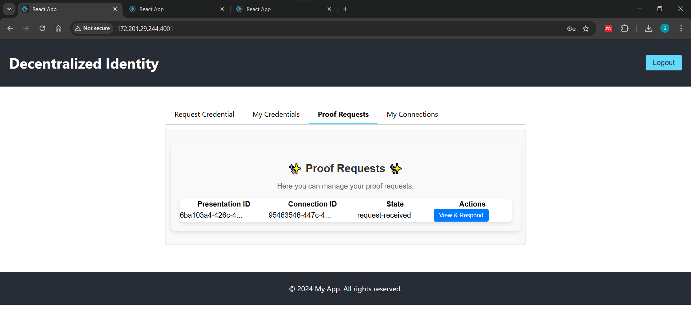

# Assignment Setup Instructions

After cloning this repo, change env variable according to the requirement in .env and env-config.js files (mostly replacing IP alone is fine according to machine endpoint IP).


Then execute 


## Run Locally

Clone the project

```bash
  https://github.com/senthil-akshay27/dy-assignment.git
```

Go to the project directory

```bash
  cd dy-assignment
```


## Demo
After cloning this repo, change env variable according to the requirement in .env and env-config.js files (mostly replacing IP alone is fine according to machine endpoint IP).


Then execute to start all required components like indy network, agents, backend and UI servers.

```bash
  ./start.sh
```


Setup components


URL's for portals, port forward 4000,4001,4002 if required.

```bash
  # Verifier Portal 
  http://localhost:4000/

  # Holder Portal 
  http://localhost:4001/

  # Issuer Portal 
  http://localhost:4002/
```
You can replace IP with localhost if required.


## Screenshots

Open user portal with port 4001


Click Sign up to register user and to create wallet
use six number pin in password


After signup screen will be redirected to login page enter required credential to login.


Raise credential request by filling up form.


Once credential is issued it will be visible in Credential list.


To list connections select My Connections tab.


Open issuer portal with port 4002

Username: user@example.com  
Password: password


We can check credentials issued and list of connections.


Open veriifer portal with port 4000

Username: user@example.com  
Password: password


Select required credential attributes for verification.


Select user to send verification request


Go to user portal and Proof Requests tab



Click View and respond and click accept to share data with the verifier after checking the required attributes and conditions.


Go back to verifier portal, credential and verification details will be visible in popup. 
"Verified": true (Successfully verified)


"Verified": false (Successfully verified)


To Stop the setup execute

```bash
  ./stop.sh
```
